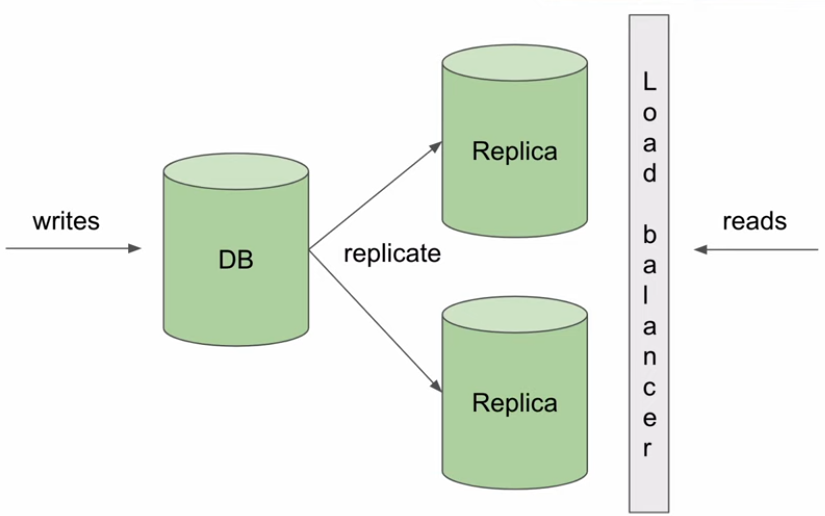
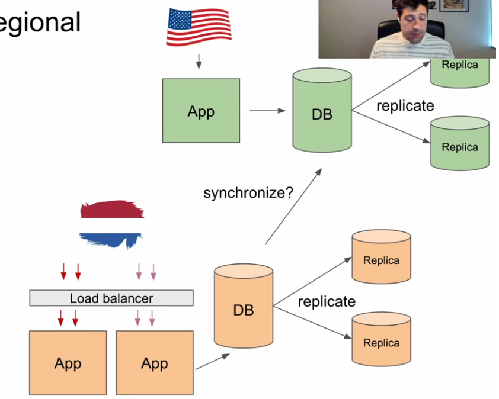
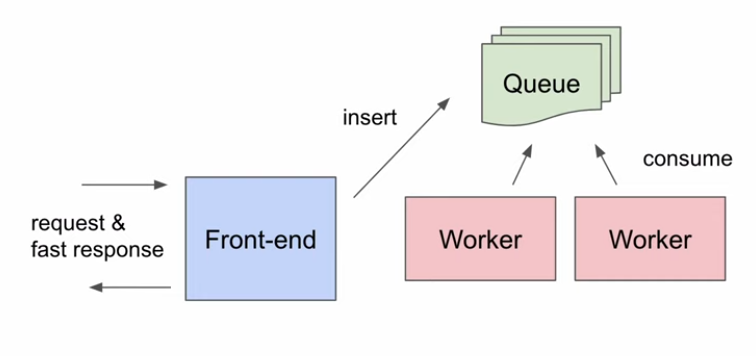

# Arquitetura de sistemas enterprise
Link: https://plataforma.deveficiente.com/cursos/arquitetura/aulas/introducao-18

## Introdução
### Desafios em sistemas enterprise:
- muitos dados
- muito usuários
- performance
- muitos produtos diferentes
- muitas equipes
- muito legado
- muitos regulamentos
- privacidade e segurança

### Fintech - gateway de pagamento
- Os pagamentos precisam acontecer o mais rápido possível
- Não pode haver erros nos dados, pagamentos duplicados, etc.
- Os comerciantes podem ajustar seu pagamento ao extremo, e sua configuração é necessária para executar cada pagamento
- Muita comunicação com partes externas (bancos, adquirentes) que podem falhar
- Amplos recursos de relatórios
- Picos durante a temporada de férias
- Meios de pagamentos do mundo todo

### 4 tópicos
- escalabilidade
- Autonomia
- infraestrutura e plataforma
- qualidade

## Escalabilidade
### Replicas do banco
- um banco de dados para tudo é difícil
- pode precisar de répca para aliviar a ccarga do banco de dados principal
- aprender a viver com consistência eventual

### Caches
- na memória é mais rápido
- inconsistência entre banco de dados e caches 
- invalidação de cache
- cache distribuido

### Escala horizontal e regional
- uma máquina num unico luggaar pde não sser suficente
- escalar de maneira regional

### Processamento assíncrono
- fazer tudo síncrono pode não funcionar
- usuário mal pode esperar coisas lentas
- escalabilidade horizontal
- "at least once"

### Banco de dados de ecrita e leitura
- relatórios caros (modelo pode ser lento)
- ETL
- Banco de dados só para relatórios para reduzir carga
- geração de relatórios em segundo plano. Avisa ao usuário que está sendo gerado e será informado quando finalizar, por exemplo.

## Autonomia
### Arquitetura baseada e eventos
- serviço interage entre si
- utilização de DQL (dead letter queue)
- desvantagem:
  - difícil de depurar
  - difícil de monmitorar

## (Micro?) Serviços
- micro-serviços não são uma solução para um problema técnico, são uma solução para um problema de pessoas
- trade-off: distribuir sistemas é difícil

## Topologia de times
- a maneira como você organiza suas equipes será refletida na arquitetura do seu sistemas
  - lei de Conway

## Papeis e responsabilidades
- individual:
  - engenheiro
  - engenheiro senior
- liderança técnica
  - staff engineer
  - principal engineer
- liderança de times
  - tech lead
  - engineering manager
- produtos
  - gerente de produto

## Ownership
- quem é dono do quê?
  - quem corrige o bug?
  - patches de segurança, quem faz?

## Infraestrutura e plataforma

## Cloud native e self-service
- tem que conseguir escalar horizontamente, independente de ser uma cloud pública ou privada
- aplicativos devem ser criados para a nuvem
- multi-nuvem?

## Times de plataforma
- equipes não precisam criar do zero um projeto. O porduto de plataforma faz essa entrega de forma transparente, sem a necessidade de conhecer todas a bibliotecas para aplicação ou criar todas a infraestrutura como código manualmente (IAC), do zero.

## Infra como enabling teams
- permitir que as equipes façam sua infra

## Qualidade
- Reúso de código
- Dívida técnica
- Testando
  - focar em testes rápidos x lentos

## Conclusão

