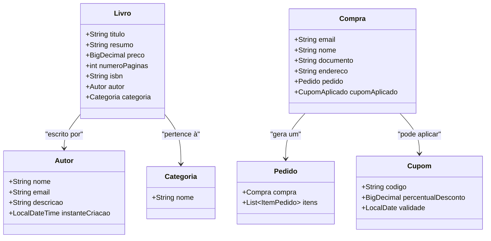
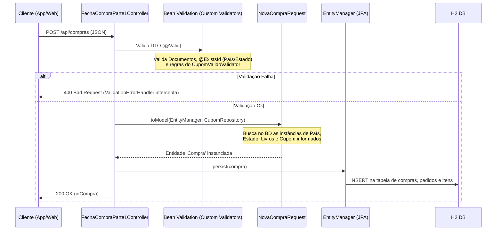

# Onboarding - Projeto Casa do Código

## Visão Geral do Projeto
O projeto **Casa do Código v2** é uma API REST para um e-commerce de livros. O objetivo principal é permitir o cadastro de autores, categorias, livros, cupons e gerenciar o fluxo de fechamento de compra (checkout).

### Tecnologias Utilizadas
- **Java 11**
- **Spring Boot 2.3.1.RELEASE** (Web, Data JPA, Validation)
- **Banco de Dados**: H2 Database (em memória, ideal para testes rápidos)
- **Testes**: JUnit 5, Jacoco e Jqwik (Property-Based Testing)

## Arquitetura e Padrões
Ao navegar pelo projeto, você notará que ele **não segue a estrutura tradicional de camadas técnicas** (onde teríamos pacotes como `controller`, `service`, `repository`). 

Em vez disso, ele utiliza um padrão focado em **Package by Feature** (Pacotes por Funcionalidade), uma abordagem muito presente no **CDD (Cognitive Driven Development)** promovido na *Jornada Dev Eficiente*. 

Cada funcionalidade da aplicação está encapsulada e isolada em seu próprio pacote, por exemplo:
- `novoautor`: Controladores, Entidades e DTOs para o cadastro de autores.
- `cadastrocategoria`: Tudo relacionado à criação de categorias.
- `cadastrolivro`: Regras e fluxos de criação de novos livros (associando a autores e categorias).
- `fechamentocompra`: O núcleo transacional (checkout), com validações complexas.

Os validadores genéricos e globais da aplicação (como as anotações customizadas do Bean Validation: `@UniqueValue`, `@ExistsId`, `@Documento`) e o manipulador de exceções (`ValidationErrorHandler`) ficam centralizados no pacote `compartilhado`.

## Modelo de Domínio (DDD)
Abaixo está um diagrama de classes simplificado contendo as principais entidades (Aggregates) identificadas e como elas se relacionam.



## Fluxo de Fechamento de Compra
Para exemplificar a interação das classes dentro de um pacote (funcionalidade), elaboramos o diagrama de sequência do principal fluxo de negócio do sistema: o fechamento da compra.

Nesta arquitetura, geralmente o DTO de requisição (Request) contém um método `toModel` (ou similar) que converte diretamente a requisição para a Entidade, injetando as dependências necessárias, como o `EntityManager` ou `Repository`, eliminando a necessidade de classes `@Service` intermediárias para fluxos simples de CRUD.



## Como Rodar Localmente
1. **Pré-requisitos**: Ter a versão correta do Java instalada (no caso, o Maven solicitará compatibilidade com Java 11).
2. Pelo terminal, na raiz do projeto, você pode subir a aplicação utilizando o Maven Wrapper que já vem embutido:
   ```bash
   ./mvnw spring-boot:run
   ```
3. A aplicação estará disponível na porta padrão do Spring Boot.
4. **Banco de Dados**: Sendo o banco `H2`, a cada restart da aplicação, a base é limpa. Isso facilita muito os testes isolados e desenvolvimento rápido.

**Links de Acesso Rápido**
- **API Base**: [http://localhost:8080/](http://localhost:8080/)
*(O projeto atualmente não exige dependências de infraestrutura, como o Docker, pois o banco de dados H2 roda embutido na aplicação na memória.)*
