# Refatorando código procedural para OO

## Bem vindo ao curso!
Nome do livro citado no vídeo: Refactoring to Patterns  por Joshua Kerievsky


## Clonando o repositório
https://github.com/forks-projects/refactoring-workshop


## O problema do cálculo de descontos: Qual o problema?
Analise o código e pense na solução em 30 minutos

O código com problema: https://github.com/forks-projects/refactoring-workshop/blob/main/workshop/src/main/java/discountapplier/DiscountApplier.java


## O problema do cálculo de descontos: Por que este código é problemático?
Identificação dos problemas:
* **Classe "Monstrinho":** A classe faz coisa demais, centralizando todas as regras de desconto (produto, valor, etc) em um único lugar.
* **Evolução via "Copia e Cola":** Para adicionar novos descontos, o desenvolvedor é obrigado a duplicar blocos de código e alterar valores manualmente.
* **Complexidade Desproporcional:** O método cresce de forma desordenada; o autor cita um exemplo real onde o código chegou a ter 37 "IFs".
* **Dificuldade de Leitura:** O código fica tão confuso que os desenvolvedores começam a escrever comentários explicativos (ex: "regra 1") em vez de ter um código legível.
* **Conexão de Métodos via Booleano:** O uso de métodos privados que retornam "true/false" para decidir se o próximo desconto deve ser aplicado é considerado uma "gambiarra".
* **Falta de Travas no Carrinho:** O método de subtrair valor aceita qualquer entrada, permitindo que o carrinho fique com valor total negativo.
* **Mutabilidade Exposta:** A classe "Carrinho de Compras" permite que qualquer um mude seu estado interno (valor total) de forma direta e sem controle.
* **Dados Fixos no Código (Hardcoding):** Nomes de produtos (Macbook, iPhone) estão escritos direto no código, o que impede que os dados venham de um banco de dados de forma elegante.


## O problema do cálculo de descontos: Quebrando o código em pequenas classes
- separar os métodos do descontos em classes separadas
- criar uma interface que determina o comportamento das classes de desconto
- a classe que chama os descontos (`DiscountApplier`) deve receber uma lista de descontos
- crie uma classe main para realizar os testes manuais. Esta classe deve criar uma lista de descontos e passar para o objeto `DiscountApplier`.

**1. Criação da Abstração**    
* [ ] Criar a interface `DiscountStrategy` (ou `DescontoStrategy`).
* [ ] Definir o contrato principal: um método público `apply(Basket basket)` (ou `aplicar`) que retorna um `boolean`.
    * *Nota: O retorno booleano indica se a regra foi aplicada, permitindo o controle de interrupção do fluxo.*

**2. Externalização das Regras de Negócio**    
* [ ] Criar a classe `DiscountPerProduct` (Desconto por Produto) implementando a interface.
* [ ] Criar a classe `DiscountPerAmount` (Desconto por Valor/Quantidade) implementando a interface.
* [ ] Mover a lógica contida nos métodos privados da classe original para dentro do método `apply` de suas respectivas novas classes.

**3. Reestruturação da Classe Principal (`DiscountApplier`)**    
* [ ] Declarar um campo privado e final: `List<DiscountStrategy> discounts`.
* [ ] Criar um construtor que receba essa lista como parâmetro (Injeção de Dependência).
* [ ] Remover os métodos privados antigos que foram migrados para as novas classes.

**4. Generalização do Processamento de Descontos**    
* [ ] No método principal de aplicação, substituir as chamadas fixas por um laço de repetição (`for` ou `stream`).
* [ ] Implementar a lógica de parada: iterar pela lista e, caso `strategy.apply(basket)` retorne `true`, interromper o loop (`break`).

**5. Implementação da Fábrica (Factory) ou Orquestrador**    
* [ ] Criar uma classe `DiscountFactory` ou um ponto de configuração no sistema.
* [ ] Instanciar as estratégias na ordem correta (ex: 1º Produto, 2º Valor).
* [ ] Passar essa lista ordenada para a classe `DiscountApplier`.

**6. Proteção e Segurança do Código**    
* [ ] Garantir que a lista de estratégias seja imutável após a construção do objeto para evitar efeitos colaterais.
* [ ] Validar se a lógica de retorno `boolean` está consistente em todas as implementações para não quebrar o fluxo de interrupção.


## O problema do cálculo de descontos: Abstraindo as regras de desconto
Refinamento sobre o projeto no estado atual (fluxograma de classes e explicação): [refinamento-projeto-para-aula-abstraindo-regras-desconto](./refinamento-projeto-para-aula-abstraindo-regras-desconto.md)

Diagrama do mapeamento de classe no mermaid com o AS IS: [Mermaid live editor](https://mermaid.ai/live/edit?utm_medium=share&utm_source=mermaid_live_editor#pako:eNq1VW1v0zAQ_iuWpUkptFG7NlkWTZPGJiQkXooGX1C-uInbWcR2sB1EGN1v55zEe3FSxgfIhzb23fPc3XNn5xbnsqA4xXlJtL5iZKcIzwSC5-gIrUkuDUWXknMpul1BONUVySnK21102-3bp-VAr4j-Ss3jffvMUCHrTUkR4bIWxje-ZdrcvTGU3yEGv_qp_WVPGvhueuIT6Zpbuw4m6Ltkhc-j641RJDfBk2zGfXfUXLRm4OrcfY9vpvmwdeGYX9VLdEN0cG0UEztUKVnUOUTaSFlSIkaCOaKHIh-c9pnwdbYeQ5X7cLZNvgkStBkf6EstmFkrlg-KtHGCR7RTRzR10MrCJiMVvQd3KKgDj9g_mmZcOLB9dvkcVB-cPklDykNe--71Xrp-MDO8yDB6MZvBGyeigUUrZQoTLQxhQjvAwwm4Yjq3k3BRVSWjyj8KRW8mnXl4JhwelCCG7hq_b2dnIAJVWyA7P_frtKxN0Ge_af9GxmhkQlzUNVXdIPth_w33uhvt_0B-MdTz0XXhi3p334fB9eERBs_hJ39VytNL4w91vIYbR6pmqNCmZmUBozs6X2MzPBiks19hONLoFDFelZTTezGeRbo2Hoa6dkg4OwO6FNWaegBXdxieD0jguCkK0EPpWUyvd4q4LNiWUY2neKdYgVOjajrFnCpO7BK3ymbY3EDeGU7htaBbUpcmw5nYA6wi4ouU3CGVrHc3ON2SUsOqrgoI2n_9nAupjbxuRO7WtGBQzLv-c2n_gIaKgqpLmzhOF0ncxsHpLf6B09VxGEXL5DiJkvlpfLpaTHGD09lJHC5Wq-gkiuJkfrKIV_sp_tlmtgjBe75cJtH8OInjVbzc_wa5Nk4m)


Linha de reaciocínio:
- **Problema**: O código atual viola o princípio de Aberto/Fechado (OCP), pois precisamos alterar a classe para cada novo desconto.
- **Decisão 1 (Encapsulamento)**: Mover a verificação de "quais produtos" para uma lista dinâmica. **Resultado**: A classe agora funciona para qualquer produto.
- **Decisão 2 (Polimorfismo)**: Perceber que "Desconto por Quantidade" e "Desconto por Produto" fazem a mesma coisa (validam critério e aplicam valor). **Resultado**: Unificação na interface `DiscountStrategy.
- **Decisão 3 (Simplificação de Abstração)**: Descartar a ideia de ter múltiplas interfaces específicas se uma interface genérica resolve o problema de forma mais simples.
- **Decisão 4 (Injeção de Dependência)**: As regras não "nascem" mais dentro das classes; elas são injetadas pela `DiscountFactory`. **Resultado**: O sistema torna-se testável e extensível sem mexer no motor principal


## O problema do cálculo de descontos: Command or Query separation
A método apply da interface DiscountStrategy aplica o desconto em algumas situações e outras não, isso causa dúvida em relação ao entendimento da nomenclatura e sua ação. Em alguns caso altera um estado e outras não. A ideia da aula é corrigir esse problema separando a responsábilidade, divindo em duas partes: verificar se o desconto pode ser aplicado e outra para realizar a alteração de estado e aplicar o desconto. Vamos chamar os métodos de **apply** e **shoulBeApplied**.


## O problema do cálculo de descontos: Encapsulamento e imutabilidade
- renomeie o metodo subtract da classe Basket para applyDiscountByPercentage. Adicione validação dos valores de entrada e aplique o desconto em cima do valor total do Basket.
```java
/**
 * Aplica desconto baseado em porcentagem.
 * Se a porcentagem de desconto for invalida, nenhum desconto é aplicado.
 * 
 * @param discountPercentage porcentagem, [0.0, 1.0]
 */
public void applyDiscountByPercentage(double discountPercentage) {
    if (discountPercentage < 0 || discountPercentage > 1) {
        // throw new IllegalArgumentException("Invalid discount percentage");
        return;
    }

    this.amount -= this.amount * discountPercentage;
}
```
- altere o método apply para as classes DiscountPerAmount e DiscountPerProduct para receber como parâmetro somente o valor do desconto
```java
public void apply(Basket basket) {
    basket.applyDiscountByPercentage(discountPercentage);
}
```

## O problema do cálculo de descontos: Dados e comportamento juntos
- Crie a classe **DiscountProduct**  com id com int, lista de string com produtos e desconto com double.
- Crie a classe **DiscountAmount**  com id com int, minItems e maxItems com int, minAmount e maxAmount com double e discount com double
- Crie a interface **DiscountRepository** com o método **getAllDiscountsPerProdut** que retorna uma lista de **DiscountProduct** e **getAllDiscountsPerAmount** que retorna uma lista De **DiscountAmount**
- Na classe **DiscountFactory** adicione como dependência do construtor a interface **DiscountRepository**. No método **build**, recupere os descontos através dos métodos **getAllDiscountsPerProdut** e **getAllDiscountsPerAmount**. Utilize a lista de **DiscountStrategy** chamada **discounts** e percorra cada tipo de desconto recuperado do banco de dados (repository) adicionando na lista **discounts**.


## O problema do cálculo de descontos: Finalizando
Esta aula é um resumo sobre o passo a passo sobre a solução do problema.

**Resumo Técnico da Evolução**
| Antes (Monolítico) | Depois (Refatorado) |
| :--- | :--- |
| Lógica centralizada em `if/else` | Lógica distribuída em classes de Estratégia |
| Dados fixos no código (*Hardcoded*) | Dados injetados via fonte externa |
| Difícil de testar (depende de tudo) | Fácil de testar (classes pequenas e isoladas) |
| Violação do SRP (Single Responsibility) | Respeito ao SRP e OCP |


## O problema do cáculo de imposto: Introdução
Classe para analise do problema: https://github.com/forks-projects/refactoring-workshop/blob/main/workshop/src/main/java/taxcalculator/TaxCalculator.java

Refinamento inicial do projeto: [refinamento_as_is_pacote_taxcalculator](./refinamento_as_is_pacote_taxcalculator.md)


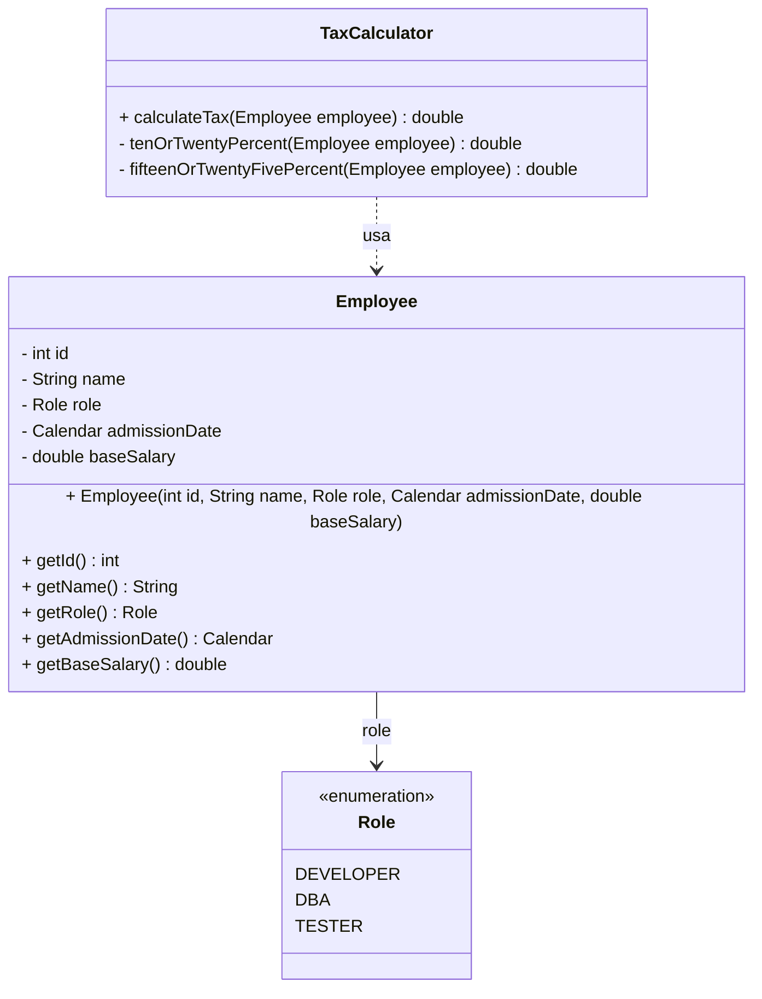


## O problemam do cáculo de imposto: Movendo as estratégias para outras classes
- crie a interface TaxCalculatorStrategy com a assintatura de método do tipo double calculate
- crie as implementações TenOrTwentyPercent e FifteenOrTwentyFivePercent
- na classe TaxCalculator, substitua as chamadas dos métodos privados pelas chamadas das implementações de TaxCalculatorStrategy.


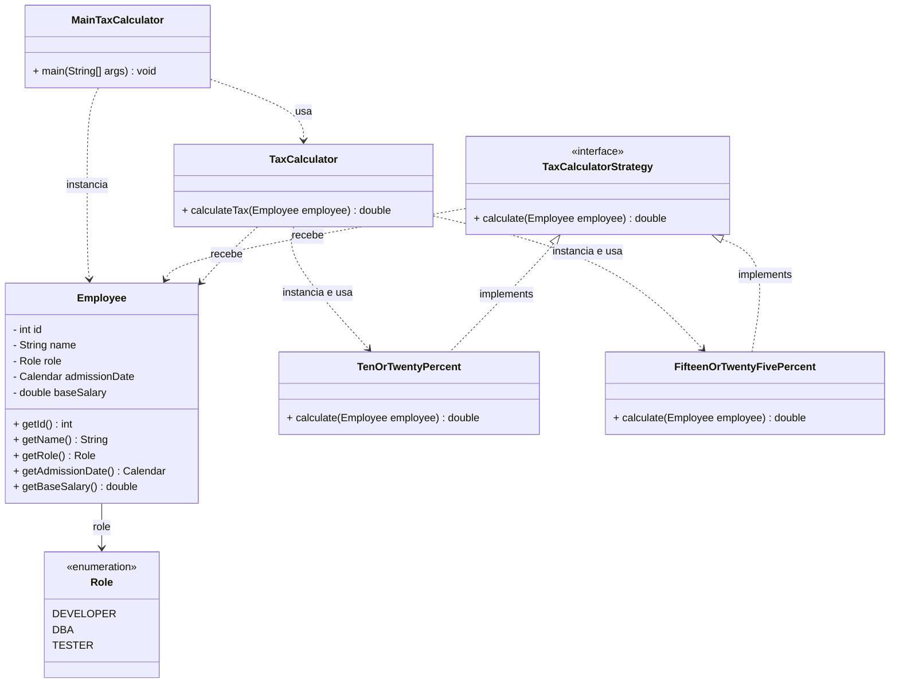


## O problemam do cáculo de imposto: Evitando repetição de código
- Crie uma classe ThreshouldBasedTaxCalculation que implementa TaxCalculatorStrategy e com os campos final: threshould, aboveTheThreshouldTax e belowTheThresghouldTax como double. Na implementação do método, reutilize o código utilizado anteriormente nas classes TenOrTwentyPercent e FifteenOrTwentyFivePercent.
- Na FifteenOrTwentyFivePercent, altere o implement para extends da ThreshouldBasedTaxCalculation
- Na classe TaxCalculator deve criar duas variaveis que representam os descontos 10/12 % de desconto e outra para o 15/25 % de desconto.

> Caso essa faixa de porcentagem for importante, poderia ser reutilizada
- as classes TenOrTwentyPercent e FifteenOrTwentyFivePercent podem mudar da implementação para uma extensão para a classe ThreshouldBasedTaxCalculation e sobrescrever o contrutor pai de acordo com a necessidade. O construtor deve ser um valor fixo sobrecrevendo

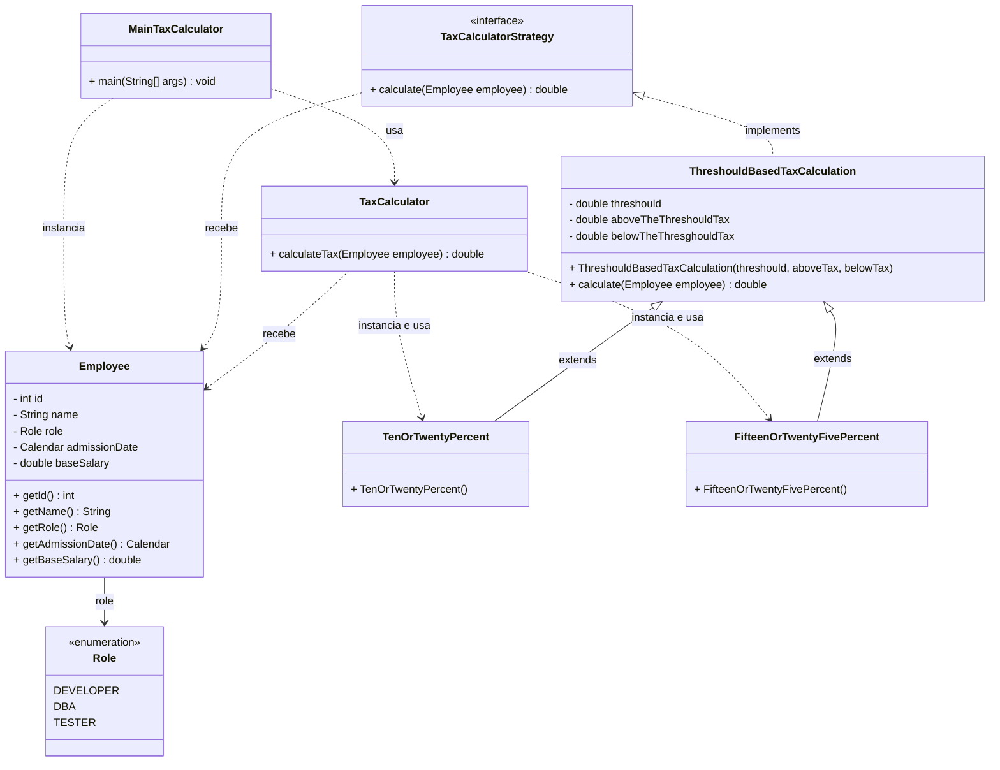


## O problemam do cáculo de imposto: Usando enums para conectar a estratégia (e o pq não funciona em cenários mais complicados)
- Adição de construtor no enum **Role** para receber o objeto **TaxCalculatorStrategy** e adição do campo strategy e atribuição no construtor.
- Atribuição da estratégia **TenOrTwentyPercent** à constante **DEVELOPER**.
- Atribuição da estratégia **FifteenOrTwentyFivePercent** às constantes **DBA** e **TESTER**.
- Adição do getStrategy
- Criação do método **calculateTax** na classe **Employee**, retornando o cálculo executado pela estratégia contida no enum.
- Atualização da classe **TaxCalculator** para invocar o método **calculateTax** do próprio objeto **Employee**.

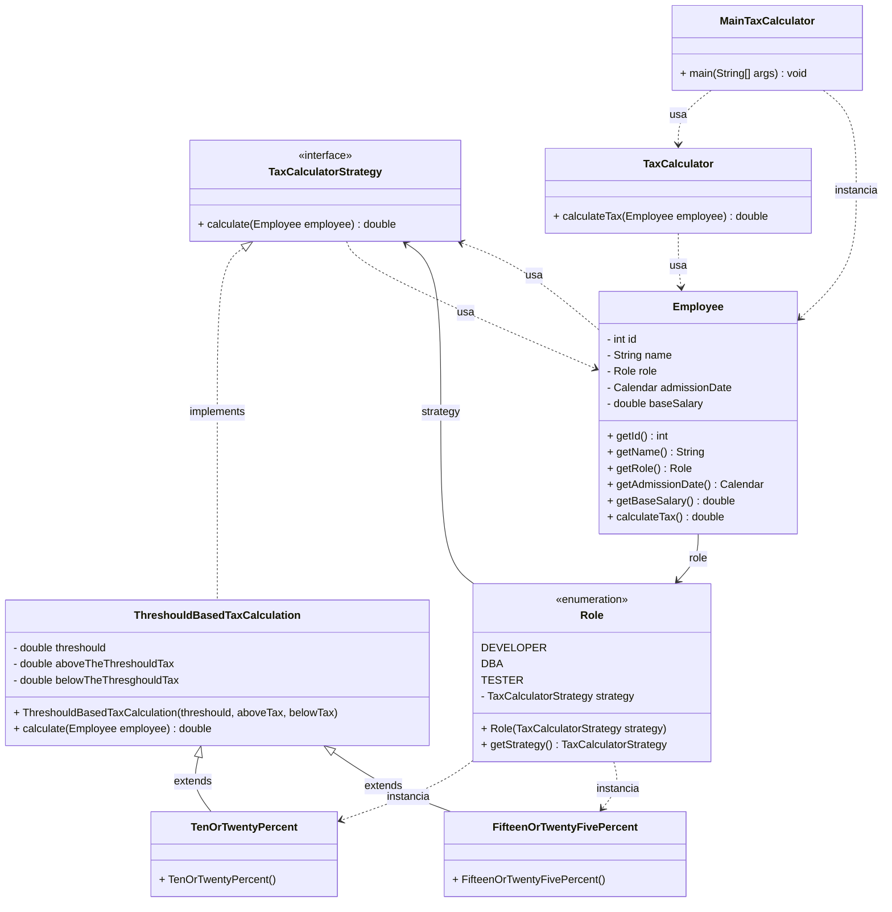


## O problemam do cáculo de imposto: Trazendo informações do banco e resumo final
- remover os parâmetros e métodos do enum Role
- remover calculateTax da classe Employee
- remover as classes TenOrTwentyPercent e FifteenOrTwentyFivePercent
- Adicione a interface TaxStrategiesRepository com o método getRoles que retorna TaxValues
- crie a classe TaxValues com a propriedades threshould, aboveTax e belowTax
- criar a classe TaxCalculationResolver com construtor recebe uma TaxStrategiesRepository. Adicione o método forRole(Role role) que retorna uma TaxCalculatorStrategy. No corpo do método recupere a TaxValues e crie um objeto de ThreshouldBasedTaxCalculation com os valores.
- Na classe TaxCalculator passe um TaxCalculationResolver no construtor e no método calculateTax recupere a estratégia com o resolver e execute a estratégia com o método calculate.


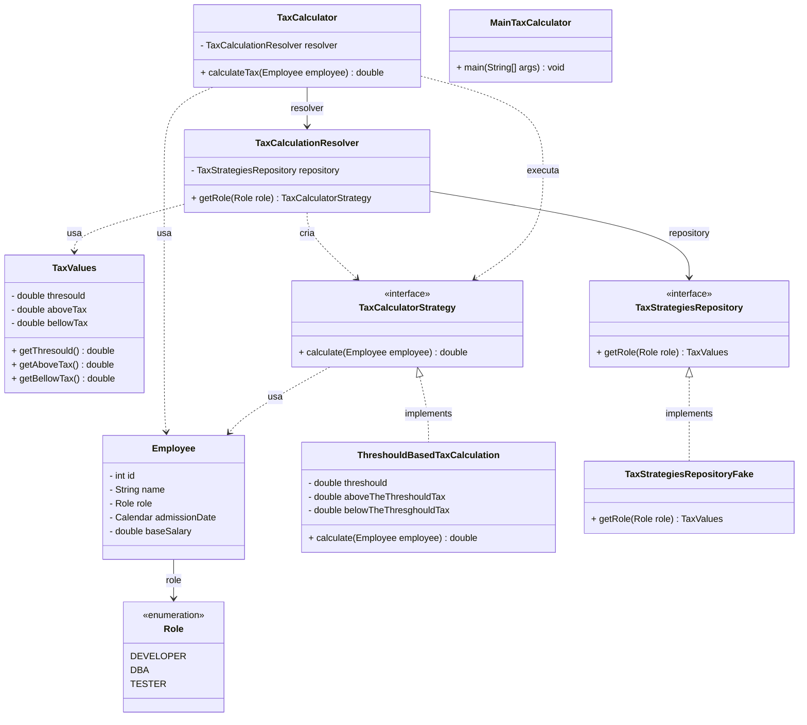


## O problema da geração de notas fiscais: Introdução ao desafio
- O problema: https://github.com/forks-projects/refactoring-workshop/blob/main/workshop/src/main/java/invoicegenerator/InvoiceGenerator.java
- Refinamento: [link](./refinamento-invoicegenerator-geracao-nota-fiscal.md)
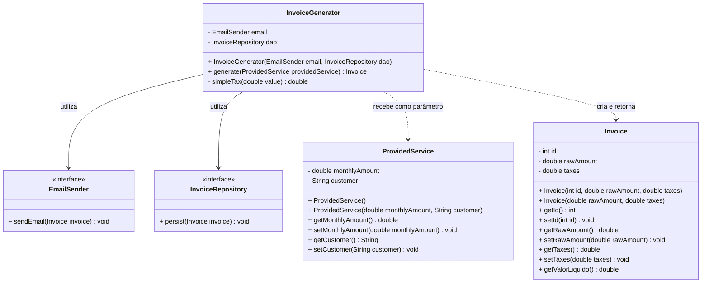


## O problema da geração de notas fiscais: O padrão Observer
O código sofria de alto acoplamento e violava o Princípio Aberto/Fechado, exigindo modificações manuais e novas dependências diretas na classe geradora sempre que uma nova ação pós-geração de nota fiscal precisava ser adicionada.

- crie a interface InvoiceGeneratedAction com método void chamado process que recebe uma Invoice
- altere a classe EmailSender para implementar InvoiceGeneratedAction e renomeie para SendInvoiceEmailAction.
- crie uma classe chamada de PersistInvoiceAction que implementa InvoiceGeneratedAction e recebe no construtor um InvoiceRepository
- Na classe InvoiceGenerator deve receber uma lista de InvoiceGeneratedAction. No método generate, deve-se percorrer a lista de ações e executar o método process.
- crie a classe InvoiceGeneratorFactory com o método build que retorna uma lista de ações (InvoiceGeneratedAction). Nele deve-se adicionar todas as ações que devem ser utilizadas pela aplicação.

**Relação com o Padrão Observer**    
Essa solução é fortemente inspirada no Pattern Observer (onde um objeto notifica o mundo sobre suas mudanças).

A única diferença da implementação estrita do GoF (Gang of Four) é que, no padrão tradicional, a lista de observadores fica dentro da própria entidade (Invoice). O autor do vídeo prefere deixar a lista no serviço/gerador para manter a entidade limpa e focada apenas nas suas regras de negócio e atributos.

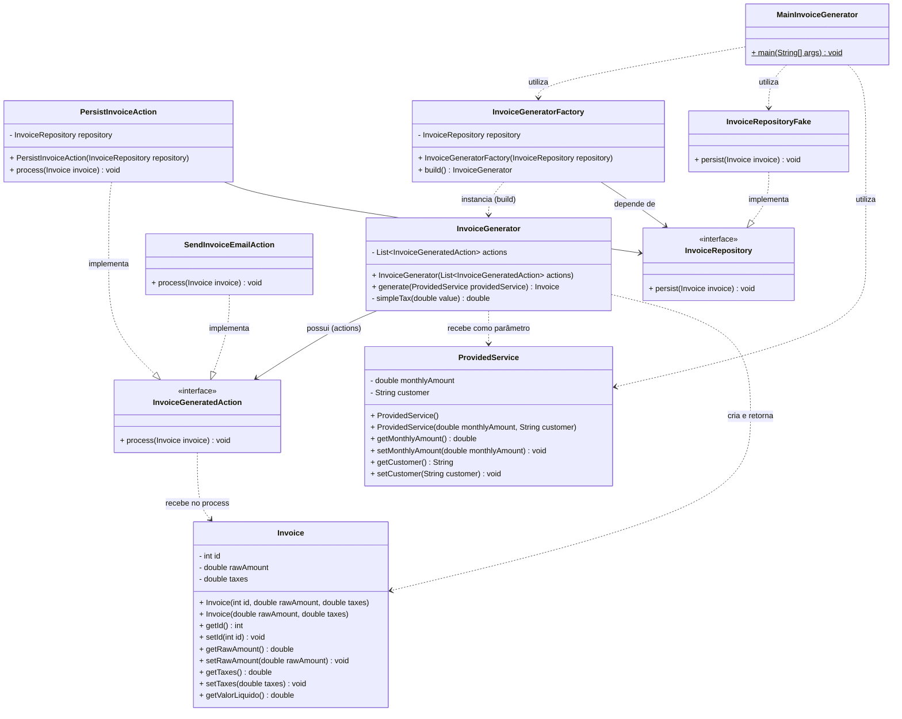

## O problema da geração de notas fiscais: Event-based architectures
### Contexto e Limitações
* **Abordagem Anterior (Local):** Usar o padrão *Observer* ou listas de ações direto no código funciona bem para fluxos simples, pois reduz o acoplamento e facilita os testes.
* **O Problema:** Em sistemas complexos (*enterprise*), onde uma ação engatilha várias outras em cadeia, centralizar tudo no código gera um fluxo confuso e difícil de manter.


### A Solução: Arquitetura Baseada em Eventos
* **Conceito:** Quando uma ação ocorre, o sistema gera um **Evento** (ex: `InvoiceGenerated`) contendo todos os dados relevantes (a nota fiscal) e o envia para uma fila (como **Kafka**).
* **Produtor:** A classe que gera a nota apenas dispara o evento e encerra seu trabalho. Ela não sabe quem vai consumir a informação.
* **Consumidores:** Componentes independentes escutam a fila e reagem ao evento de forma assíncrona (ex: um salva no banco de dados, outro envia o e-mail).


### Trade-offs (Prós e Contras)
* **Vantagens:** Desacoplamento extremo e facilidade para evoluir o sistema (adicionar novos consumidores sem mexer no código antigo).
* **Desvantagens:** Requer infraestrutura pesada, torna o monitoramento complexo e dificulta a depuração (*debug*), já que os logs ficam espalhados e não há um *stack trace* único.


### Conclusão
Use soluções simples em código para fluxos de negócio comuns. Deixe a arquitetura baseada em eventos para cenários complexos que realmente justifiquem o custo da infraestrutura.

Exemplo de código da aula:
```java
public class InvoiceGenerated {

    private Invoice nf;

    public InvoiceGenerated(Invoice nf) {
        this.nf = nf;
    }

    public Invoice getNf() {
        return nf;
    }
}


public class InvoiceGenerator {

    public InvoiceGenerator() {
    }

    public Invoice generate(ProvidedService providedService) {

        double amount = providedService.getMonthlyAmount();

        Invoice nf = new Invoice(amount, simpleTax(amount));

        disparaEvento(new InvoiceGenerated(nf));

        return nf;
    }

    private double simpleTax(double value) { return value * 0.06; }
}
```


## O problema da geração de notas fiscais
Resumo retomando sobre a refatoração e a possibilidade de usar a arquitetura baseada em eventos para casos mais complexos.


## O problema do processador de pagamentos: Introdução ao problema
- Exemplo de código inicial: https://github.com/forks-projects/refactoring-workshop/blob/main/workshop/src/main/java/paymentprocessor/PaymentProcessor.java
- Refinamento: [refinamento_as_is_paymentprocessor](./refinamento_as_is_paymentprocessor.md)

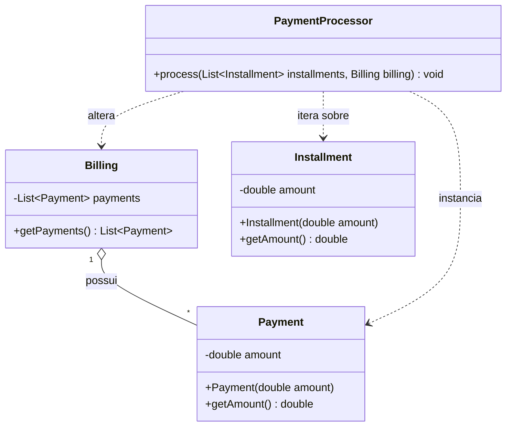


## O problema do processador de pagamentos: Information hiding
- adicione o método addPayment na classe Billing para encapsular o acesso na lista de payments.
- remova o método getPayments da classe Billing caso não tenha utilidade ou podemos retornar uma lista imutável e evitar que alguém com acesso a lista consiga alterar os payments

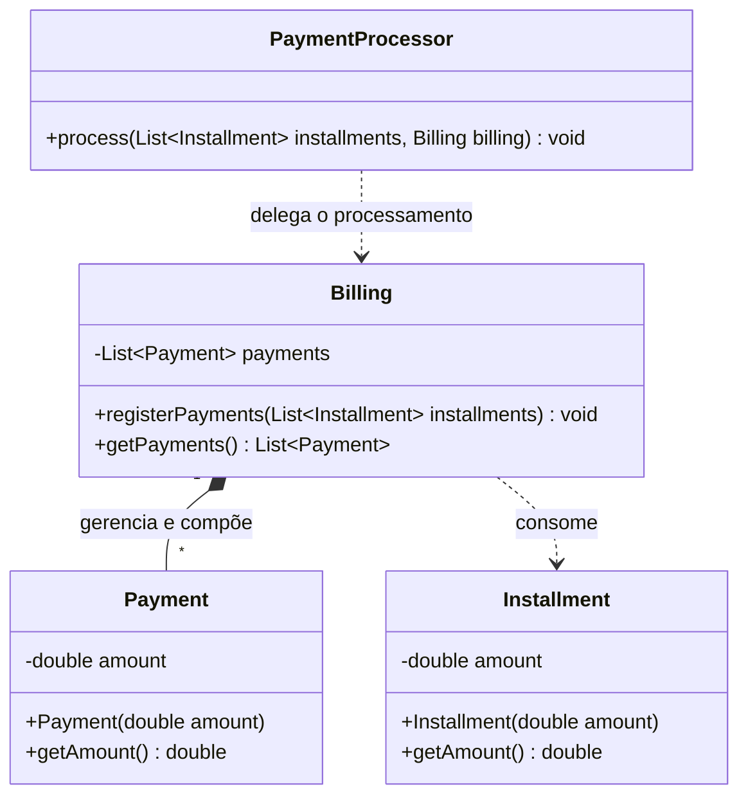


## O problema do processador de pagamentos: Resumo
### O Erro Comum: Vazamento de Encapsulamento
* **O Problema:** Permitir que o cliente manipule diretamente as estruturas internas de uma classe (como dar um `getLista().add()` na lista de pagamentos da classe `Billing`) destrói o encapsulamento.
* **Consequência:** A classe perde o controle sobre seus próprios dados. Se uma nova regra de negócio surgir (ex: limite máximo de 10 pagamentos), ela terá que ser replicada manualmente com *Ctrl+F* por todo o sistema, tornando o código impossível de escalar.

### A Solução: Controle Absoluto da Entidade
* **Entidade Sagrada:** Toda classe/entidade deve ter controle absoluto sobre seus dados e como eles são manipulados.
* **Centralização:** Modificações devem passar exclusivamente por métodos da própria classe (ex: um método `addPayment()`). Assim, regras de negócio são validadas em um único lugar, afetando o sistema inteiro de forma segura.
* **Orientação a Objetos de Verdade:** Não trate classes apenas como meros sacos de dados editáveis por qualquer um. Proteja o estado do objeto para garantir a consistência das regras.


## O problema do quebra-cabeça: Introdução ao problema
- Refinamento incial do projeto Puzzle: [](./refinamento_as_is_puzzle.md)

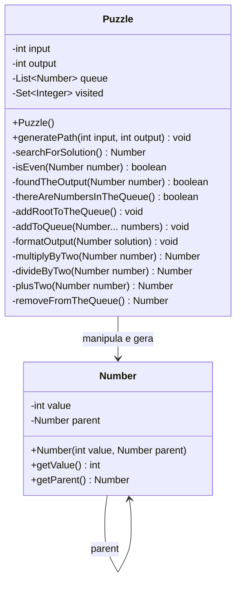


## O problema do quebra-cabeça: Separação de responsabilidades
- separe os métodos searchForSolution e formatOutput da classe Puzzle em classe apartadas
- crie uma classe chamada PuzzleOutput e adicione o método formatOutput
- altere a classe chamada Puzzle para PuzzleSolver. Altere o método generatePath para retornar um Number
- crie uma classe chamada PuzzleRunner e adicione o PuzzleSolver e PuzzleOutput como parâmetros no construtor. Adicione o método solver como void e execute a solução e imprima a saída utilizando os objetos recebidos no construtor.


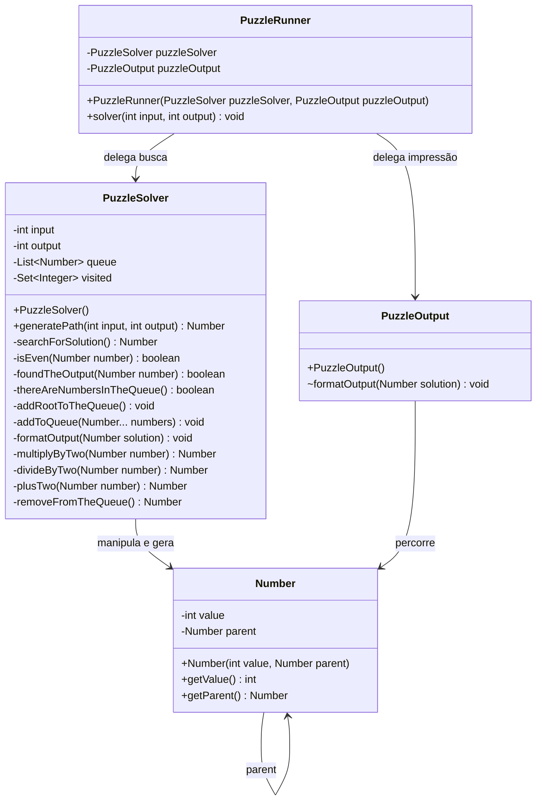
