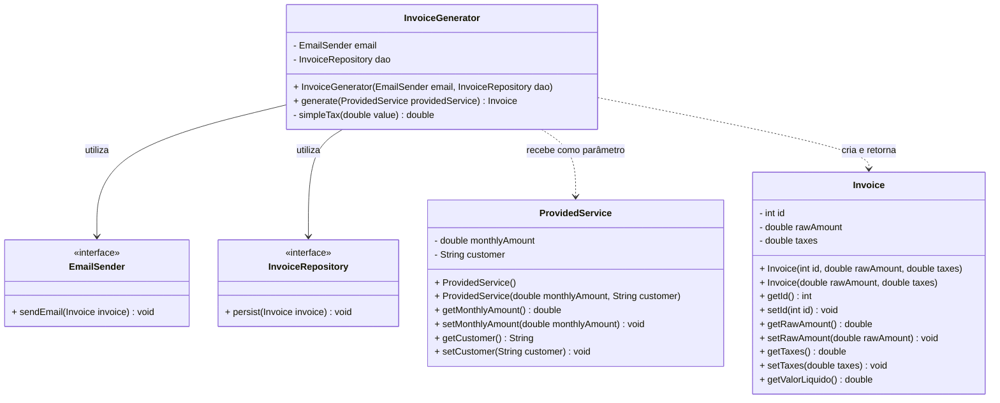

# Material de Estudo As-Is: Pacote `invoicegenerator`

## 1. Regra de Negócio (O que a aplicação faz?)

O pacote `invoicegenerator` é responsável por gerar faturas (Invoices) a partir de serviços prestados (ProvidedService). O fluxo de negócio principal ocorre na classe `InvoiceGenerator`:

- **Entrada:** O processo recebe um objeto `ProvidedService`, que representa um serviço mensal prestado a um cliente, contendo o valor mensal (`monthlyAmount`).
- **Cálculo de Impostos:** A partir do valor mensal do serviço, o sistema calcula um imposto simples. A regra atual aplica uma taxa fixa de 6% (0.06) sobre o valor do serviço prestado.
- **Geração da Fatura:** Uma nova fatura (`Invoice`) é instanciada contendo o valor bruto do serviço e o valor calculado dos impostos. A fatura possui também a capacidade de calcular seu valor líquido (`getValorLiquido()`), subtraindo os impostos do valor bruto.
- **Ações de Pós-Geração:** 
  1. A fatura gerada é enviada por e-mail através da interface `EmailSender`.
  2. A fatura é persistida (salva) no banco de dados através da interface `InvoiceRepository`.
- **Saída:** O processo retorna a fatura (`Invoice`) recém-criada e processada.

Entidades principais:
- **`ProvidedService`**: Representa os dados do serviço prestado (valor mensal e nome do cliente). Funciona como o dado de origem.
- **`Invoice`**: Representa a nota/fatura resultante, contendo o valor bruto, os impostos aplicados e a lógica para obter o valor líquido.

## 2. Mapeamento Técnico (Como funciona hoje?)

Abaixo está o diagrama de classes exato de como as entidades, serviços e interfaces estão estruturados e se relacionam atualmente no código.

## 3. Pontos de Atenção

Analisando a estrutura atual (sem propor refatorações, apenas apontando o estado real), notam-se as seguintes características:

- **Magic Numbers:** O cálculo de imposto `value * 0.06` está "chumbado" (hardcoded) no método `simpleTax` dentro de `InvoiceGenerator`, o que dificulta manutenções futuras caso a taxa mude ou existam diferentes taxas para diferentes serviços.
- **Mistura de Responsabilidades no Gerador:** O `InvoiceGenerator` orquestra regras de cálculo matemático (o método `simpleTax`) e lida com infraestrutura/efeitos colaterais (chamando envio de e-mail e persistência).
- **Entidades com Modelagem Anêmica / DTO-like:** A classe `ProvidedService` atua basicamente como um DTO de entrada. A classe `Invoice` já possui um leve comportamento (`getValorLiquido()`), mas também expõe todos os seus atributos via setters (`setId`, `setRawAmount`, `setTaxes`), o que quebra o encapsulamento e permite que a fatura seja alterada indevidamente após sua criação.
- **Nomenclatura Mista:** O código apresenta misturas de idiomas. A maioria dos termos está em inglês (`Invoice`, `rawAmount`, `taxes`), mas o método para obter o valor com desconto chama-se `getValorLiquido()`, e uma variável interna no `InvoiceGenerator` chama-se `nf` (provavelmente sigla para Nota Fiscal em português).
