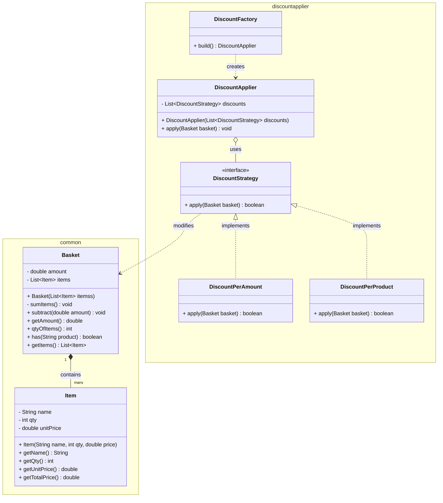

# Material de Estudo: Motor de Descontos (As-Is)

Bem-vindo ao projeto! Este documento foi preparado para auxiliar no entendimento do estado atual da nossa aplicação, servindo como base antes de iniciarmos o processo de refatoração procedural para Orientação a Objetos.

---

## 1. Regra de Negócio: O que a aplicação faz?

A aplicação gerencia uma **Cesta de Compras (Basket)** composta por diversos **Itens (Item)**. A principal funcionalidade é o seu **Motor de Descontos**, que avalia o conteúdo da cesta e aplica reduções de preço com base em regras predefinidas. 

### O Fluxo da Aplicação

1. Uma `Basket` (cesta) é criada contendo uma lista de objetos `Item`. Logo no momento da sua criação, a cesta já faz a soma dos preços totais dos itens para ter um valor bruto.
2. A aplicação utiliza o `DiscountFactory` para instanciar o aplicador central, chamado `DiscountApplier`.
3. O `DiscountApplier` é carregado com diferentes estratégias de descontos e recebe a cesta para processá-la.
4. Ele percorre a lista de regras, avaliando uma por uma até que uma delas conceda um desconto. Quando a primeira regra for aplicada com sucesso, o fluxo de descontos é interrompido.

### Quais são as regras de desconto atuais?

A aplicação possui duas estratégias de desconto já mapeadas e que funcionam em cascata:

**A. Desconto por Combinação de Produtos (`DiscountPerProduct`)**
Esta estratégia verifica se determinados produtos específicos existem juntos na mesma cesta.
- Combo 1: Se a cesta possuir "MACBOOK" **e** "IPHONE", subtrai **15%** do valor total da cesta.
- Combo 2: Se a cesta possuir "NOTEBOOK" **e** "WINDOWS PHONE", subtrai **12%** do valor total da cesta.
- Combo 3: Se a cesta possuir um "XBOX", subtrai **70%** do valor da cesta.

**B. Desconto por Valor e Quantidade (`DiscountPerAmount`)**
Esta estratégia baseia-se na quantia financeira gasta e no número de itens comprados:
- Até 1000 de valor e até 2 itens: Desconto de **2%**.
- Acima de 3000 de valor, com mais de 2 e menos de 5 itens: Desconto de **5%**.
- Acima de 3000 de valor e 5 itens ou mais: Desconto de **6%**.

> [!NOTE]
> A implementação atual altera o valor *diretamente* dentro do objeto `Basket` e as regras de negócio de desconto estão atreladas a classes que funcionam como "serviços", uma característica forte de design procedural.

---

## 2. Mapeamento Técnico: Como o projeto funciona hoje?

Os domínios e lógicas estão limitados a dois pacotes: `common` e `discountapplier`. Abaixo você encontrará o detalhamento fiel de como o código está estruturado.

### Diagrama de Classes

### Pontos de Atenção na Arquitetura (Oportunidades de Refatoração)
- **Anemia na Entidade `Basket`**: O método `subtract(double amount)` permite que o estado interno do valor seja modificado externamente por qualquer classe, sem garantias de regras de domínio.
- **Side Effects e Tipagem**: A interface `DiscountStrategy` impõe que seus contratos retornem um booleano apenas para sinalizar controle de fluxo.
- **Acoplamento e Hardcoding**: A classe `DiscountPerProduct` sabe o nome exato dos itens no formato de String (ex: `"XBOX"`), o que prejudica a extensibilidade. O mesmo ocorre para o `DiscountPerAmount`, que possui números como `1000` ou `3000` injetados diretamente nos comandos de fluxo condicional (`if/else`).
