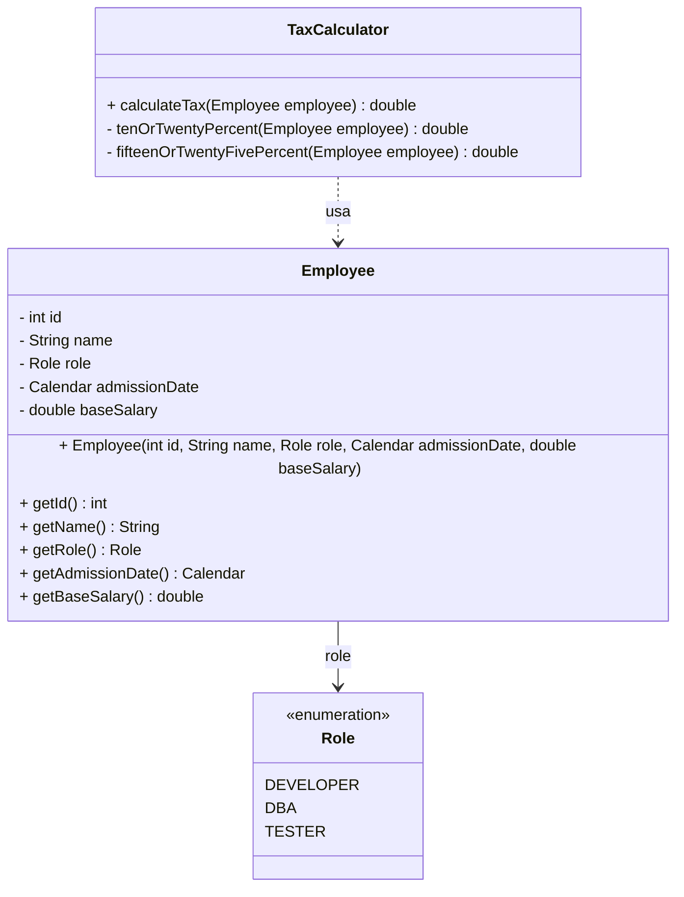

# Material de Estudo As-Is: Pacote `taxcalculator`

## 1. Regra de Negócio (O que a aplicação faz?)

O pacote é responsável por realizar o cálculo do salário líquido de um funcionário após os descontos de impostos (embora o método se chame `calculateTax`, a lógica matemática retorna o valor final do salário deduzido). 

O fluxo é baseado inteiramente no **Cargo** (Role) e no **Salário Base** (Base Salary) do funcionário:

*   **Desenvolvedores (DEVELOPER):**
    *   Se o salário base for maior que R$ 3.000,00, é aplicado um desconto de 20% (o funcionário retém 80% do salário).
    *   Caso contrário (menor ou igual a R$ 3.000,00), o desconto é de 10% (retém 90%).
*   **DBAs e Testadores (DBA, TESTER):**
    *   Se o salário base for maior que R$ 2.000,00, o desconto é de 25% (retém 75%).
    *   Caso contrário (menor ou igual a R$ 2.000,00), o desconto é de 15% (retém 85%).
*   **Outros Cargos:**
    *   A aplicação não suporta outros cargos e lança uma exceção genérica (`RuntimeException("invalid employee")`) caso receba um cargo não mapeado.

As entidades principais são o `Employee` (que atua apenas como um contêiner de dados) e o `TaxCalculator`, que centraliza todas as regras e decisões.

## 2. Mapeamento Técnico (Como funciona hoje?)

Abaixo está o diagrama de classes que reflete a exata estrutura do código atualmente:

## 3. Pontos de Atenção (Estado Atual)

*   **Modelo de Domínio Anêmico**: A classe `Employee` possui apenas atributos, construtor e *getters*, sem nenhum comportamento associado (apenas estrutura de dados).
*   **Design Procedural e Baixa Coesão**: A classe `TaxCalculator` concentra toda a inteligência e as regras condicionais (múltiplos `if`s baseados no cargo). Isso fere o princípio do Aberto/Fechado (OCP), pois qualquer novo cargo ou mudança de alíquota exigirá a alteração dessa mesma classe.
*   **Nomenclatura Enganosa e Acoplamento**: O método principal `calculateTax` sugere que o valor devolvido é a taxa (o imposto), mas a matemática (`baseSalary * 0.8`) devolve o salário líquido. Além disso, métodos como `tenOrTwentyPercent` expressam como a regra foi implementada em vez da intenção do negócio.
*   **Magic Numbers**: As faixas salariais (3000.0, 2000.0) e os multiplicadores de cálculo (0.8, 0.9, 0.75, 0.85) estão fixos ("hardcoded") no meio dos métodos privados.
