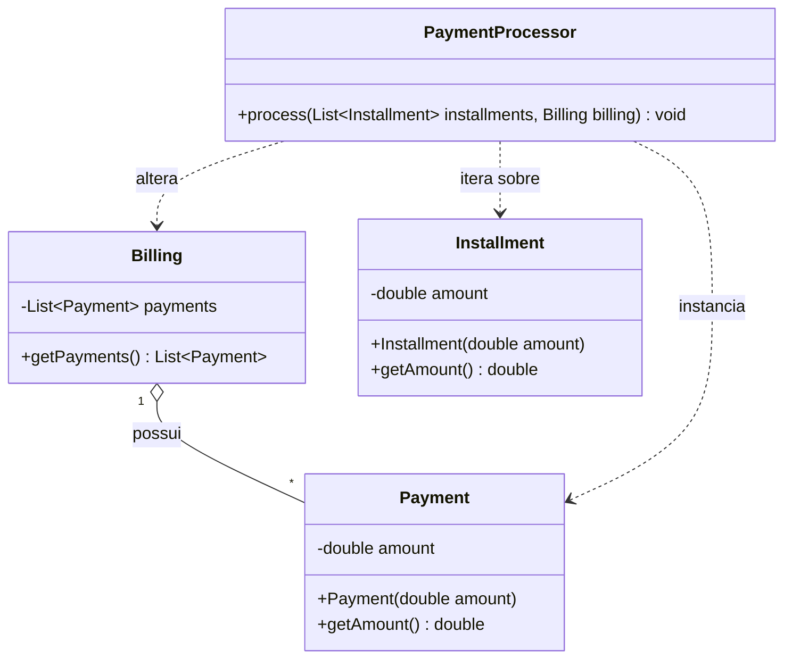

# Análise As-Is: Pacote PaymentProcessor

Este documento detalha o funcionamento atual (As-Is) do pacote `paymentprocessor`, sem propor ou aplicar refatorações.

## 1. Regra de Negócio (O que a aplicação faz?)

O fluxo de negócio atual do pacote `paymentprocessor` é responsável por processar uma lista de parcelas e registrá-las como pagamentos em uma fatura/cobrança.

- **Processamento:** O componente central `PaymentProcessor` recebe uma lista de parcelas (`Installment`) e um objeto de cobrança (`Billing`).
- **Conversão e Registro:** Para cada parcela recebida, o sistema extrai o seu valor original, cria um novo objeto de pagamento (`Payment`) com este mesmo valor e o adiciona diretamente à lista de pagamentos da cobrança (`Billing`).

A lógica é estritamente sequencial, não havendo no momento regras adicionais de validação, cálculo de juros ou condições de parada complexas dentro do processador.

## 2. Mapeamento Técnico (Como funciona hoje?)

Abaixo está o diagrama de classes atual, mapeado com os nomes exatos utilizados no código-fonte.

## 3. Pontos de Atenção

Analisando a arquitetura atual, destacam-se os seguintes pontos de atenção quanto ao design das classes (estado atual):

- **Quebra de Encapsulamento:** Em `PaymentProcessor`, a inclusão de um pagamento é feita modificando diretamente a lista interna da entidade `Billing` (`billing.getPayments().add(payment)`), o que delega ao serviço o controle de estado da entidade.
- **Classes Anêmicas:** As entidades `Billing`, `Installment` e `Payment` atuam primariamente como estruturas de dados (apenas com construtores, getters e propriedades privadas), enquanto a regra de iteração e vínculo está toda contida no `PaymentProcessor` (Procedural).
- **Acoplamento à Implementação:** `Billing` inicializa sua lista como `ArrayList` na declaração do atributo, mas o getter retorna a interface `List`. No entanto, a forma como a lista é exposta e manipulada externamente tira o controle da classe sobre as inserções de pagamentos.
