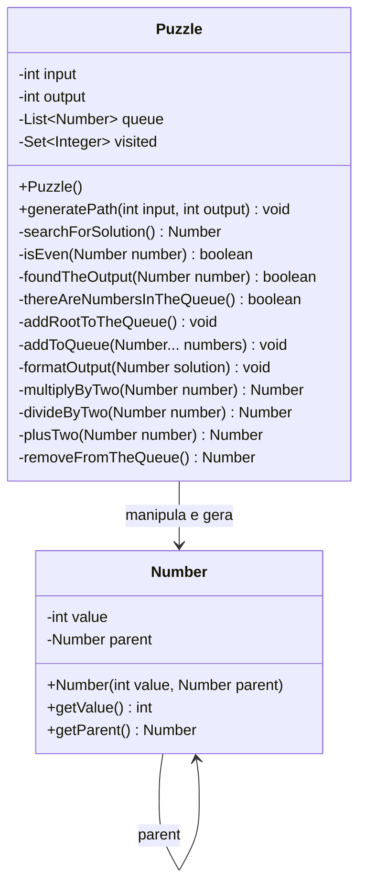

# refinamento As-Is do Pacote `puzzle`

Esta é a análise do pacote `puzzle`, com foco em entender o estado atual do código (As-Is) sem aplicar refatorações.

### 1. Regra de Negócio (O que a aplicação faz?)

O pacote `puzzle` implementa um algoritmo de busca para encontrar o caminho mais curto de operações matemáticas necessárias para transformar um número inicial (`input`) em um número final desejado (`output`). 

**Entidades Principais:**
*   **`Puzzle`**: É a classe orquestradora que conduz a busca pela solução. Ela gerencia o estado da busca (quais números já foram processados e quais ainda precisam ser verificados) e aplica as regras matemáticas para gerar novos números.
*   **`Number`**: Representa um "nó" no caminho da solução. Além de guardar o valor numérico em si, ele guarda uma referência para o número anterior (`parent`) que o gerou. Isso é essencial para, ao final, reconstruir a sequência exata de operações que levou do `input` até o `output`.

**Regras Críticas e Fluxo:**
1.  **Operações Permitidas**: A partir de um número atual, o algoritmo tenta criar novos números através de três operações matemáticas:
    *   Multiplicar por 2.
    *   Dividir por 2 (esta operação possui uma regra condicional: só é aplicada se o número atual for par).
    *   Somar 2.
2.  **Mecanismo de Busca (Breadth-First Search)**: O algoritmo explora as possibilidades utilizando uma fila (`queue`). Ele analisa o primeiro número da fila, gera os próximos números possíveis aplicando as operações permitidas e os adiciona ao final da fila. Isso garante que a solução encontrada seja o caminho mais curto.
3.  **Prevenção de Loops Infinitos**: Para evitar que o algoritmo fique processando os mesmos números repetidamente, existe um controle de números já visitados (`visited`). Um novo número gerado só é adicionado à fila de processamento se o seu valor ainda não tiver sido visitado.
4.  **Condição de Parada**: A busca encerra no momento em que um número gerado tiver o valor exatamente igual ao `output` desejado.
5.  **Formatação do Resultado**: Ao encontrar a solução, o algoritmo percorre os nós retroativamente (do `output` até o `input` usando a referência `parent` da classe `Number`), monta uma string com a sequência dos valores e a imprime diretamente no console (Standard Output).

---

### 2. Mapeamento Técnico (Como funciona hoje?)

Abaixo está o diagrama de classes representando a estrutura exata de como as classes, atributos e métodos estão implementados atualmente no código-fonte.

---

### 3. Pontos de Atenção

Analisando a implementação atual sob uma ótica técnica, sem propor refatorações, notam-se os seguintes pontos característicos da arquitetura As-Is:

*   **Acoplamento com I/O**: A classe `Puzzle` possui uma responsabilidade de negócio (calcular a rota) acoplada com uma responsabilidade de infraestrutura/I/O (imprimir no console), já que o método `formatOutput` executa um `System.out.println` direto ao invés de retornar o resultado para quem chamou.
*   **Fila Subótima**: A fila de processamento (`queue`) está implementada usando uma `ArrayList`. O método `removeFromTheQueue()` remove sempre o elemento no índice 0 (`queue.remove(0)`), o que em uma `ArrayList` causa o deslocamento (shift) de todos os outros elementos do array, resultando em uma complexidade de tempo *O(n)* para cada remoção (característica de performance subótima para filas intensas).
*   **Nulabilidade Explícita no Fluxo**: O método `searchForSolution` passa propositalmente valores `null` para o método `addToQueue` quando a divisão por dois não é aplicável (`isEven(currentNumber)? divideByTwo(currentNumber) : null`), delegando ao `addToQueue` a responsabilidade de verificar e ignorar esses nulos (`if(number != null)`).
*   **Ausência de Encapsulamento da Busca**: Os atributos de estado da busca (`input`, `output`, `queue`, `visited`) pertencem à instância da classe `Puzzle`. Isso significa que a classe mantém estado mutável (Stateful), o que a impede de ser *thread-safe* ou reutilizável de forma segura para múltiplas chamadas concorrentes sem re-instanciação.
